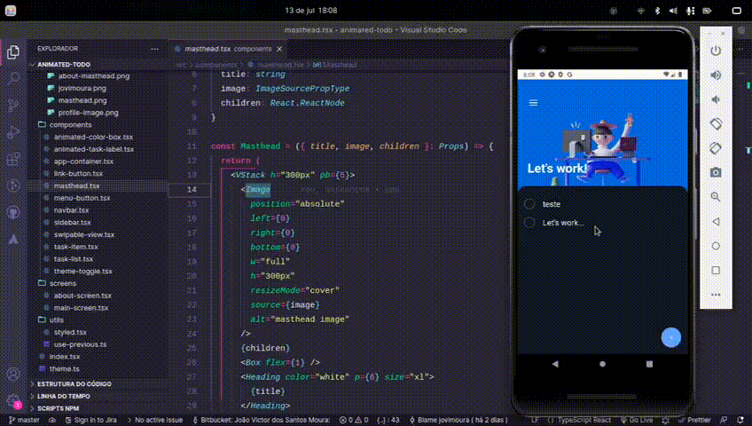

# Animated To Do List 📱

<p>
  🇺🇸 Animated To Do App made with React Native, Expo and JavaScript!
</p>

<br />

<p>
  🇧🇷 Animated To Do App feito com React Native, Expo e JavaScript!
</p>

## 🇺🇸 If you want to analyze the project on your machine, follow this step by step. 🇧🇷 Caso você queira analisar o projeto em sua máquina, siga este passo a passo:

## 🇺🇸 ENG

### Clone

```
git clone
```

### Access the folder

```
cd <folder>
```

### Install dependencies

```
npm install
```

### Start application

```
npm run start
```

### default port:

```
exp://192.168.0.12:19000
```

<br>

## 🇧🇷 PT-BR

### Clone o repositório

```
git clone
```

### Acesse o diretorio

```
cd <nome-da-pasta>
```

### Instale as dependências

```
npm install
```

### Inicie a aplicação

```
npm run start
```

### A aplicação, por padrão, fica na porta:

```
exp://192.168.0.12:19000
```

## 🇺🇸 Image | 🇧🇷 Imagem do projeto



## 🇺🇸 Tecnologies and Libs | 🇧🇷 Tecnologias e Bibliotecas utilizadas

<ul>
    <li>React Native</li>
    <li>Styled Components</li>
    <li>Native Base</li>
    <li>Moti</li>
    <li>React Native Bouncy Checkbox</li>
    <li>React Native Gesture Handler</li>
    <li>React Native Screens</li>
    <li>React Native Reanimated</li>
    <li>React Native Safe Area Context</li>
    <li>React Native SVG</li>
    <li>React Native Web</li>
    <li>TypeScript</li>
    <li>Expo</li>
    <li>Expo Linking</li>
    <li>Expo Status Bar</li>
</ul>

## 🇧🇷 Feito por | 🇺🇸 Made by:

### João Victor dos Santos Moura

### E-mail: joaovictors.mouraa@gmail.com

### Linkedin: https://www.linkedin.com/in/jovimoura10/
